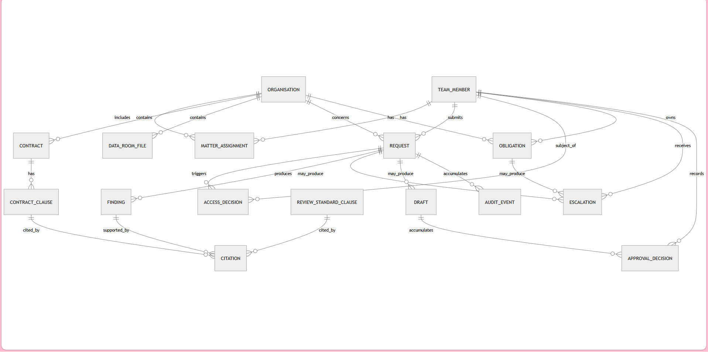

**Rasikh — Data Schema / Database Model Specification**

*Primary sources: approved PRD, System Architecture Specification, and the actual project data files (`firm_team.json`, `organizations.json`, `obligations.json`, contracts/, dataroom/, requests/, rulebook/, answer_key.json, README). Requirement IDs preserved. Terminology from PRD/Architecture retained.*

**Key grounding from actual data (overrides pure inference where conflict exists):**

- Access is recorded and checked at **organisation** level (`org_id`). `firm_team.json` uses `"access": "firm_wide"` or an array of `ORG-xxxx`. `organizations.json` carries `assigned_team` (member_ids). Contracts and data-room files are headed “Matter: ORG-xxxx”. Requests carry “Matter: ORG-xxxx”. There is **no separate matter entity or matter_id** in the supplied data files.
- Consequently, in this schema **Organisation is the access-scoping unit** (what Architecture calls “matter” for access, isolation, and privilege). A distinct Matter table is retained only if future multi-matter-per-org is required; it is marked OPEN QUESTION and is not required by the supplied data.
- Privileged protection is demonstrated by DR-04 (explicitly “PRIVILEGED & CONFIDENTIAL — attorney work product”, “Access: matter team only”).
- Review standard lives as ~35 numbered clauses across six markdown files in `rulebook/`.
- Request types and decisions appear in request headers and `answer_key.json` (REVIEW_CONTRACT, ANSWER_CONSULTATION, PREP_MEETING, FLAG_OBLIGATION, ESCALATE, REQUEST_INFO, NOT_IN_DOCUMENTS, REFUSE_ACCESS, REFUSE_OVERRIDE).
- No invented entities, fields, roles, statuses, or rules.

---

## 1. Required Entities (Step 1)

| Entity | Purpose | Source requirement(s) | Why it exists | Explicit / Inferred |
| -------- | --------- | ----------------------- | --------------- | --------------------- |
| TeamMember | Firm members, role, access scope, approval capability | FR-004, SEC-001, SEC-003, firm_team.json | Sole source for authorization decisions; carries `can_approve` | Explicit (data + PRD) |
| Organisation | Client organisations (150); access unit | organizations.json, SEC-001, FR-003 | Access, obligations, contracts, files, requests all scoped by org | Explicit (data) |
| MatterAssignment | Who may access which organisation | SEC-001, Rule 2, firm_team + organizations | Deterministic lookup; never derived from request text | Explicit (Architecture + data) |
| Contract | Matter contracts (12 supplied) | FR-008, FR-010, FR-021, FR-022 | Source of clause-level findings | Explicit |
| ContractClause | Clause-level unit for citation | GRD-003, FR-011, FR-021 | Enables precise, verifiable citations and tricky-pair handling | Inferred (required by grounding + FR-021) |
| DataRoomFile | Non-contract files (6 supplied) | FR-008, SEC-004, Rule 7 | Includes privileged file DR-04 | Explicit |
| ReviewStandardClause | ~35 numbered clauses of the firm’s review standard | FR-009, GRD-002, rulebook/ | Second citation source; risk taxonomy, thresholds, escalation rules, gates | Explicit |
| Request | Incoming work item + lifecycle status | FR-001, FR-002, FR-033 | Intake, classification, status tracking | Explicit |
| AccessDecision | Every access check (authorized / unauthorized) | SEC-006, Rule 1, FR-006 | Audit of positive and negative decisions; basis never request text | Explicit |
| Finding | Atomic citable output of review/consultation | FR-011, FR-019, GRD-001 | Carries statement, grounded flag, risk, Sharia flag, tricky-case type | Explicit |
| Citation | Links Finding → real source clause | GRD-002–GRD-005, FR-019, FR-020 | Enforces “cite or say not in the documents”; FK prevents invented citations | Explicit |
| Obligation | Calendar entries with owner, due date, band | FR-016–FR-018, OBL-*, obligations.json | Deadline classification + overdue escalation | Explicit |
| Escalation | Hard-case routing (litigation, statutory, Sharia ruling, missed deadline) | ESC-001–ESC-006, FR-023–FR-026 | No drafted legal answer for these cases | Explicit |
| Draft | AI-produced content awaiting lawyer action | APR-001–APR-005, FR-028–FR-032 | Versioned content + approval_state | Explicit |
| ApprovalDecision | Recorded lawyer approve/reject (tied to draft version) | FR-029–FR-032, APR-004, Rule 5 | Sole path to “final”; records who/when/version | Explicit |
| AuditEvent | Append-only lifecycle record | FR-033, SEC-006, NFR-002, NFR-003 | Traceability of every step including unauthorized attempts | Explicit |

No separate “User”, “Role”, “Notification”, “Delivery”, or “Client” tables. Lawyer/Reviewer and Scholar are capabilities/roles on TeamMember (OPEN QUESTION on exact modelling of Scholar remains as in Architecture). No soft-delete columns (requirements do not call for them).

---

## 2. Analysis of Provided Data Files (Step 2)

### firm_team.json

- 10 members.
- Fields: `member_id` (string PK, e.g. L-01), `name`, `role` (partner / senior_associate / associate / paralegal), `practice`, `access` (“firm_wide” or array of ORG-ids), `can_approve` (boolean).
- Candidate PK: member_id.
- Relationships: access arrays ↔ organisations; can_approve drives ApprovalDecision eligibility.
- Enums: role values above.
- No nulls observed. Partners always firm_wide + can_approve=true; others scoped + can_approve varies.

### organizations.json

- 150 organisations.
- Fields: `org_id` (ORG-xxxx), `name`, `sector`, `type`, `status` (active/dormant), `assigned_team` (array of member_ids).
- Candidate PK: org_id.
- Relationships: assigned_team ↔ TeamMember; contracts/files/obligations/requests reference org_id as “matter”.
- This is the access-scoping unit in the data.

### obligations.json

- 8 obligations.
- Fields: `obl_id`, `org_id`, `type`, `description`, `due_date` (YYYY-MM-DD), `owner` (member_id), optional `note`.
- Today’s date in data = 2026-07-01 → OB-04 is overdue, others map to urgent/reminder/on_track via rulebook thresholds.
- Candidate PK: obl_id. FKs: org_id, owner → TeamMember.

### contracts/ (12 files)

- Plain-text contracts. Header: CONTRACT C-xx, Matter: ORG-xxxx, Language (English/Arabic).
- Clause numbers present (1, 2, 3, 7, 9 …). Contain the documented tricky pairs (fixed expiry vs auto-renewal; capped vs uncapped-via-carve-out; missing governing law; interest/penalty for Sharia flags).
- No machine-readable JSON; text must be chunked into ContractClause rows at load time.
- Arabic contracts (C-09, C-10, C-11) stored and cited in Arabic.

### dataroom/ (6 files)

- Plain-text. One privileged: DR-04 (Manar, ORG-1055). Explicit privilege language and “Access: matter team only”.
- Modelled with `privileged` boolean.

### requests/ (27 files)

- Header fields: Request ID (L-C-xxx), Matter (ORG-xxxx), From (name + email), Requester member_id, Type, Date.
- Body = free-text request. Types observed align with PRD (contract_review, etc.). Two Arabic.
- One external/unauthorized requester appears in the set (REFUSE_ACCESS cases).

### rulebook/

- Six markdown files containing the ~35 numbered clauses (0.1–0.6 gates, checklist, risk taxonomy, Sharia constructs, obligation thresholds, escalation rules).
- Must be loaded as ReviewStandardClause rows with clause_number + category.

### answer_key.json

- Ground truth per request (not runtime data). Confirms expected access decisions, citations, tools, rationale. Used for evaluation only; not a schema table.

**Inconsistencies / OPEN QUESTIONS visible from data vs Architecture**

- Architecture speaks of “Matter”; data uses Organisation as the sole access unit. Schema treats Organisation as the matter-access unit. A separate Matter table is optional (OPEN QUESTION).
- Privilege exact rule (“matter team members with role ≥ Associate” vs “any assigned_team member”) is not fully specified beyond “matter team only” for DR-04. Schema stores `privileged` boolean; application enforces the second check.
- Risk taxonomy labels and exact obligation threshold days live only inside rulebook clauses; never hard-coded.
- “Lawyer/Reviewer” and “Scholar” are not distinct account types in firm_team.json; modelled as capabilities on TeamMember (`can_approve`, practice).

No contradictions that break the architecture; data simply realises “matter” as organisation-scoped access.

---

## 3. Relational Schema (PostgreSQL) (Step 3)

All tables use UUID primary keys except where the supplied data already uses stable string identifiers (member_id, org_id, contract_id, obl_id, request_id). Those natural keys are preserved as the PK (or unique alternate key) for fidelity to the data files.

### team_member

| Column | Data Type | Nullable | Key | References | Description |
| -------- | ----------- | ---------- | ----- | ------------ | ------------- |
| member_id | text | No | PK | | L-01 … L-10 (from data) |
| name | text | No | | | |
| role | text | No | | | partner / senior_associate / associate / paralegal (CHECK) |
| practice | text | Yes | | | |
| can_approve | boolean | No | | | Default false; true for partners + designated seniors |
| created_at | timestamptz | No | | | Default now() |

### organisation

| Column | Data Type | Nullable | Key | References | Description |
| -------- | ----------- | ---------- | ----- | ------------ | ------------- |
| org_id | text | No | PK | | ORG-xxxx |
| name | text | No | | | |
| sector | text | No | | | |
| type | text | No | | | |
| status | text | No | | | active / dormant (CHECK) |

### matter_assignment

| Column | Data Type | Nullable | Key | References | Description |
| -------- | ----------- | ---------- | ----- | ------------ | ------------- |
| assignment_id | uuid | No | PK | | |
| member_id | text | No | FK | team_member(member_id) | |
| org_id | text | No | FK | organisation(org_id) | |
| UNIQUE (member_id, org_id) | | | | | Prevents duplicate assignments |

*Partners with firm_wide access are represented either by an explicit row per org or by a role-level rule evaluated in application code (OPEN QUESTION; either satisfies SEC-001).*

### contract

| Column | Data Type | Nullable | Key | References | Description |
| -------- | ----------- | ---------- | ----- | ------------ | ------------- |
| contract_id | text | No | PK | | C-01 … C-12 |
| org_id | text | No | FK | organisation(org_id) | Access unit |
| title | text | No | | | |
| language | text | No | | | en / ar (CHECK) |
| privileged | boolean | No | | | Default false |
| content_uri | text | Yes | | | Pointer to stored full text |
| created_at | timestamptz | No | | | |

### contract_clause

| Column | Data Type | Nullable | Key | References | Description |
| -------- | ----------- | ---------- | ----- | ------------ | ------------- |
| clause_id | uuid | No | PK | | |
| contract_id | text | No | FK | contract(contract_id) | |
| clause_label | text | Yes | | | “1”, “7.2”, etc. |
| text | text | No | | | Original language (Arabic kept as Arabic) |
| checklist_area | text | Yes | | | term_renewal / liability / payment / termination / governing_law / gap / other |
| UNIQUE (contract_id, clause_label) where clause_label not null | | | | | |

### data_room_file

| Column | Data Type | Nullable | Key | References | Description |
| -------- | ----------- | ---------- | ----- | ------------ | ------------- |
| file_id | text | No | PK | | DR-01 … DR-06 |
| org_id | text | No | FK | organisation(org_id) | |
| title | text | No | | | |
| privileged | boolean | No | | | Default false; true for DR-04 |
| content_uri | text | No | | | |

### review_standard_clause

| Column | Data Type | Nullable | Key | References | Description |
| -------- | ----------- | ---------- | ----- | ------------ | ------------- |
| standard_clause_id | uuid | No | PK | | |
| clause_number | text | No | UNIQUE | | “0.1”, “1.2”, “3.3”, etc. |
| text | text | No | | | |
| category | text | No | | | gate_grounding / gate_approval / access_by_matter / privilege / review_checklist / risk_taxonomy / sharia_sensitive / obligation_threshold / escalation_rule / other |

### request

| Column | Data Type | Nullable | Key | References | Description |
| -------- | ----------- | ---------- | ----- | ------------ | ------------- |
| request_id | text | No | PK | | L-C-xxx (or generated UUID for new) |
| requester_id | text | No | FK | team_member(member_id) | |
| org_id | text | Yes | FK | organisation(org_id) | Nullable until Matter Identification; required thereafter |
| request_type | text | Yes | | | contract_review / consultation / meeting_prep / obligation_check (set by Classification) |
| raw_content | text | No | | | Never used by access-decision logic |
| status | text | No | | | intake / classified / access_denied / processing / escalated / drafted / awaiting_approval / approved / edited / rejected / insufficient (CHECK) |
| created_at | timestamptz | No | | | |

### access_decision

| Column | Data Type | Nullable | Key | References | Description |
| -------- | ----------- | ---------- | ----- | ------------ | ------------- |
| access_decision_id | uuid | No | PK | | |
| request_id | text | No | FK | request(request_id) | |
| member_id | text | No | FK | team_member(member_id) | |
| org_id | text | No | FK | organisation(org_id) | |
| outcome | text | No | | | authorized / unauthorized (CHECK) |
| decided_at | timestamptz | No | | | |
| basis | text | No | | | Always references MatterAssignment / firm_wide rule; never raw_content |

### finding

| Column | Data Type | Nullable | Key | References | Description |
| -------- | ----------- | ---------- | ----- | ------------ | ------------- |
| finding_id | uuid | No | PK | | |
| request_id | text | No | FK | request(request_id) | |
| checklist_area | text | Yes | | | Same enum as contract_clause |
| statement | text | No | | | |
| grounded | boolean | No | | | false only for explicit “not in the documents” |
| risk_rating | text | Yes | | | Value taken from rulebook risk taxonomy at runtime (not hard-coded) |
| sharia_sensitive_flag | boolean | No | | | Default false |
| tricky_case_type | text | Yes | | | fixed_expiry / auto_renewal / capped_liability / uncapped_liability / capped_with_uncapped_carveout / none |

### citation

| Column | Data Type | Nullable | Key | References | Description |
| -------- | ----------- | ---------- | ----- | ------------ | ------------- |
| citation_id | uuid | No | PK | | |
| finding_id | uuid | No | FK | finding(finding_id) | |
| source_type | text | No | | | contract_clause / standard_clause (CHECK) |
| contract_clause_id | uuid | Yes | FK | contract_clause(clause_id) | Required if source_type = contract_clause |
| standard_clause_id | uuid | Yes | FK | review_standard_clause(standard_clause_id) | Required if source_type = standard_clause |
| CHECK (exactly one of the two source IDs is non-null) | | | | | |
| Application rule: a Finding with grounded=true must have ≥1 Citation; grounded=false must have 0 | | | | | |

### obligation

| Column | Data Type | Nullable | Key | References | Description |
| -------- | ----------- | ---------- | ----- | ------------ | ------------- |
| obligation_id | text | No | PK | | OB-xx |
| org_id | text | No | FK | organisation(org_id) | |
| owner_id | text | No | FK | team_member(member_id) | |
| type | text | No | | | |
| description | text | No | | | |
| due_date | date | No | | | |
| band | text | No | | | overdue / urgent / reminder / on_track (computed from due_date + rulebook thresholds; stored for query convenience) |
| note | text | Yes | | | |

### escalation

| Column | Data Type | Nullable | Key | References | Description |
| -------- | ----------- | ---------- | ----- | ------------ | ------------- |
| escalation_id | uuid | No | PK | | |
| request_id | text | Yes | FK | request(request_id) | Exactly one of request_id / obligation_id |
| obligation_id | text | Yes | FK | obligation(obligation_id) | |
| reason | text | No | | | litigation / statutory_question / sharia_ruling / missed_deadline (CHECK) |
| routed_to_id | text | No | FK | team_member(member_id) | Lawyer or Scholar |
| evidence_reference | text | Yes | | | Pointer to authorized file/finding |
| created_at | timestamptz | No | | | |
| CHECK (exactly one of request_id, obligation_id is non-null) | | | | | |

### draft

| Column | Data Type | Nullable | Key | References | Description |
| -------- | ----------- | ---------- | ----- | ------------ | ------------- |
| draft_id | uuid | No | PK | | |
| request_id | text | No | FK | request(request_id) | |
| content | text | No | | | Current (possibly edited) text |
| version | integer | No | | | Starts at 1; increments on edit |
| approval_state | text | No | | | awaiting_approval / approved / edited / rejected (CHECK) |
| created_at | timestamptz | No | | | |
| updated_at | timestamptz | No | | | |

### approval_decision

| Column | Data Type | Nullable | Key | References | Description |
| -------- | ----------- | ---------- | ----- | ------------ | ------------- |
| approval_decision_id | uuid | No | PK | | |
| draft_id | uuid | No | FK | draft(draft_id) | |
| reviewer_id | text | No | FK | team_member(member_id) | Must have can_approve=true (enforced in app) |
| decision | text | No | | | approved / rejected (CHECK) |
| decided_at | timestamptz | No | | | |
| draft_version | integer | No | | | The version that was decided upon |

### audit_event

| Column | Data Type | Nullable | Key | References | Description |
| -------- | ----------- | ---------- | ----- | ------------ | ------------- |
| audit_event_id | uuid | No | PK | | |
| request_id | text | Yes | FK | request(request_id) | Nullable for pure obligation escalations |
| event_type | text | No | | | intake / classified / access_checked / document_retrieved / finding_produced / escalated / draft_created / draft_edited / approved / rejected / … |
| actor_id | text | Yes | FK | team_member(member_id) | |
| detail_reference | text | Yes | | | Pointer (table + id) to AccessDecision / Finding / Escalation / Draft / ApprovalDecision |
| detail_json | jsonb | Yes | | | Optional structured snapshot |
| occurred_at | timestamptz | No | | | Append-only; never updated |

**Indexes (justified):**

- matter_assignment (member_id, org_id) — access lookups
- access_decision (request_id), (member_id, org_id, decided_at)
- finding (request_id), citation (finding_id)
- obligation (org_id, due_date), (band)
- draft (request_id, approval_state), approval_decision (draft_id)
- audit_event (request_id, occurred_at), (event_type, occurred_at)
- contract / data_room_file (org_id) — matter isolation

**No soft-delete columns.** Requirements call for append-only audit, not soft deletion of operational rows.

---

## 4. Relationships (Step 4)

- Organisation 1 → N Contract, DataRoomFile, Obligation, Request (once identified), MatterAssignment  
  *Why:* Data files bind every content object and access decision to an org_id; this is the isolation boundary (SEC-007).

- TeamMember 1 → N MatterAssignment, Request, AccessDecision, Obligation (as owner), Escalation (as recipient), ApprovalDecision, AuditEvent  
  *Why:* Authorization, ownership, and accountability all resolve to a firm member.

- MatterAssignment N ↔ N (TeamMember ↔ Organisation)  
  *Why:* Sole authoritative source for access decisions (SEC-001, Rule 2).

- Contract 1 → N ContractClause  
  *Why:* Clause-level citation and FR-021 tricky-pair logic require it.

- Request 1 → N AccessDecision, Finding, Draft, Escalation (optional), AuditEvent  
  *Why:* Full lifecycle + multiple access checks possible (e.g., privileged file).

- Finding 1 → N Citation; Citation → exactly one of (ContractClause | ReviewStandardClause)  
  *Why:* GRD-001–GRD-005; FK existence + application “was-retrieved” check.

- Obligation 0..1 → Escalation (missed-deadline path)  
  *Why:* FR-018 / ESC-004.

- Draft 1 → N ApprovalDecision (one per version that is decided)  
  *Why:* Edit-then-approve history (FR-030, APR-003/004).

All relationships are required by explicit requirements or by the need to enforce an explicit requirement (grounding, access-before-documents, approval gate).

---

## 5. Audit / History (Step 5)

Single **append-only** `audit_event` table (Architecture §12 recommendation).  
Every lifecycle transition writes one row:

- request creation (intake)
- classification
- access_checked (both outcomes)
- document_retrieved (only after positive AccessDecision)
- finding_produced
- escalated
- draft_created / draft_edited
- approved / rejected

`detail_reference` + optional `detail_json` point at the concrete row. Because the table is never updated or deleted, operational edits (e.g., Draft.content change) do not erase history (NFR-002/NFR-003). Unauthorized attempts are always recorded (SEC-006).

---

## 6. Security-Sensitive Data Support (Step 6)

- **Access before document reading:** Schema stores AccessDecision; Document Access component (application code) is the only path that may join Contract / DataRoomFile / ContractClause, and only when a matching AccessDecision.outcome = 'authorized' exists for the current (member_id, org_id, request). Schema cannot enforce order of operations; application does.
- **Authorization from assignment records only:** AccessDecision.basis references MatterAssignment / firm_wide rule. Request.raw_content is never an input to the access function signature.
- **Matter isolation:** Every content-bearing table carries org_id; all retrieval queries filter by the request’s resolved org_id.
- **Privilege:** `privileged` boolean on Contract and DataRoomFile. Second independent check in Document Access (even an authorized matter member may be blocked). Exact privilege rule remains OPEN QUESTION.
- **Approval gate:** No path to “final” status exists without an ApprovalDecision.decision = 'approved' matching the current Draft.version. Application enforces FR-032 / Rule 5.

Schema stores the facts; application code implements the gates.

---

## 7. Grounding & Citations (Step 7)

- Finding.grounded = true ⇒ ≥1 Citation row whose FK points at a real ContractClause or ReviewStandardClause that Retrieval actually returned for that request.
- Finding.grounded = false ⇒ zero Citation rows and statement contains the explicit “not in the documents” language (FR-020, GRD-005).
- Citation FKs make invention of a non-existent clause impossible at the database level (GRD-004). Application additionally verifies the cited clause was in the retrieved set for the request.
- Arabic clauses keep original text; citations reference the Arabic source (FR-022).

---

## 8. Lawyer Approval (Step 8)

- Draft starts in `awaiting_approval`.
- Edit increments version and may set state `edited`.
- ApprovalDecision records reviewer (must have can_approve), decision, timestamp, and the exact draft_version.
- Only an ApprovalDecision with decision='approved' against the current version satisfies the Approval Gate.
- Rejected is terminal and non-final.
- Full history of edits and decisions is preserved via version + ApprovalDecision rows + AuditEvent.

---

## 9. Normalization Notes (Step 9)

- No duplicated assignment data: MatterAssignment is the single source.
- No JSON blobs for core relational facts (access, citations, approvals). Optional detail_json on AuditEvent only.
- Obligation.band is a derived convenience column (recomputed from due_date + rulebook thresholds); source of truth remains the rulebook.
- Risk_rating is free text / enum whose allowed values come from rulebook at runtime.
- Many-to-many only where required (assignments).
- Status fields are constrained enums matching Architecture lifecycle.
- No unnecessary history tables; one append-only audit log suffices.

---

## 10. ERD (Step 10)

## OPEN QUESTIONS (explicitly carried forward)

1. Whether a separate Matter entity (1 org → N matters) is required; supplied data treats Organisation as the access unit.
2. Exact privilege scoping rule beyond “matter team only” for DR-04.
3. Whether firm_wide partners are materialised as MatterAssignment rows or evaluated by role rule.
4. Modelling of Scholar as a distinct capability/role on TeamMember.
5. Precise risk-taxonomy labels and numeric obligation thresholds (live only inside rulebook; schema does not hard-code them).

This schema is the smallest relational model that satisfies every explicit requirement in the PRD and Architecture while remaining faithful to the structure and values present in the supplied data files. Application-level gates (access-before-documents, citation existence, approval gate) remain outside the schema, as required by SEC-005 and Rule 5.
