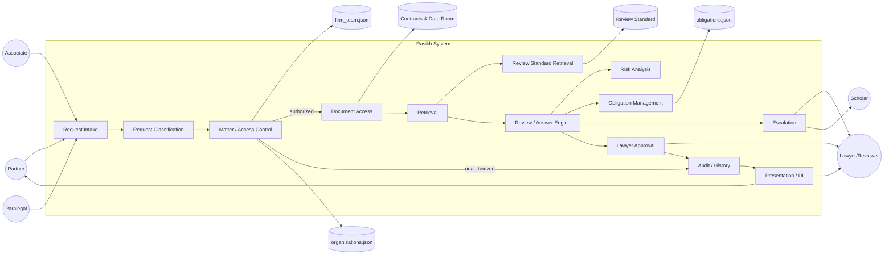

# Rasikh — System Architecture Specification

*Derived from the approved PRD (`docs/PRD.md`) and the Requirements Inventory. Describes HOW the product works. Requirement IDs are carried through from the PRD.*

---

## 1. Architecture Overview

Rasikh is structured as a **guarded pipeline**: a request passes through a fixed sequence of deterministic gates (classification → matter identification → access check → retrieval) before any AI reasoning touches matter content, and passes through a second deterministic gate (approval) before anything is treated as final. The two mandatory gates identified in the brief — access-before-documents and grounded-or-not-given, backed by lawyer approval — are implemented as **application-code checks that sit outside the AI's own reasoning**, not as instructions given to the model. The AI component is scoped narrowly: it classifies, retrieves (within a boundary the application has already fixed), analyzes, drafts, and proposes escalation — it never decides who is authorized, and it never decides that its own draft is final.

The architecture is intentionally the smallest set of components that satisfies the Requirements Inventory: an intake/classification layer, an access-control layer, a retrieval layer scoped to authorized matter data plus the review standard, a review/answer engine, an obligation engine, an escalation router, a lawyer approval workflow, and an audit/history store — with a thin presentation layer (review queue, request history, counts panel) over the top.

---

## 2. System Context

**Actors** (from the PRD): Partner, Associate, Paralegal, Lawyer/Reviewer, Scholar, Client/Counterparty (out of scope for direct interaction), and the AI Assistant as an internal system component rather than an external actor.

**External/internal data sources the system reads:**
- Firm team and assignment records (`firm_team.json`) — read on every access check.
- Client organisation records (`organizations.json`).
- The obligation calendar (`obligations.json`).
- Matter contracts and data-room files (including privileged files and Arabic-language contracts).
- The firm's review standard (~35 numbered clauses).
- The typed request set that drives intake.

**System boundary.** The product itself is the boundary; it does not send anything outside itself to a client or counterparty (OOS-007). All actor interaction happens through the intake mechanism (submitting requests) and the presentation layer (review queue, history, counts panel).



---

## 3. Major Components

Only components with a direct requirement source are included.

| Component | Responsibility | Boundary | Requirements supported |
|---|---|---|---|
| **Request Intake** | Accepts an incoming request, capturing requester identity and matter reference. | Owns request creation only; does not read matter documents. | FR-001, FR-027 |
| **Request Classification** | Determines request type (review / consultation / meeting-prep / obligation-check). | Reads request metadata only. | FR-002, AI-001 |
| **Matter / Access Control** | Determines the matter and checks the requester's authorization against the firm's assignment records. | The *sole* authority for authorization decisions. Runs before any document access. Deterministic application logic — not an AI judgment call. | FR-003, FR-004, FR-005, FR-006, FR-007, SEC-001–SEC-007, Rule 1, Rule 2, Rule 7 |
| **Document Access** | Opens/reads matter contracts and data-room files, gated on a positive access decision. | Cannot be invoked except downstream of a positive Access Control decision. | FR-005, FR-008, SEC-002, SEC-004 |
| **Retrieval** | Locates the relevant contract/file passages and review-standard clauses for the request at hand. | Scoped to documents already authorized by Access Control; scoped to the matter (no cross-matter leakage). | FR-008, FR-009, AI-002, SEC-007 |
| **Review Standard Retrieval** | Searches the ~35-clause review standard for the clauses applicable to the request, rather than supplying the whole standard. | Read-only access to the standard corpus. | FR-009, source doc note (§11.7 of Requirements Inventory) |
| **Review / Answer Engine** | Produces contract reviews, consultation answers, and meeting-prep material from retrieved, authorized content. | Cannot access documents directly — only through Retrieval, which is already access-scoped. Cannot mark its own output "final." | FR-010, FR-011, FR-014, FR-015, FR-019, FR-020, FR-021, FR-022, AI-002–AI-004, AI-007, AI-008, GRD-001–GRD-007 |
| **Risk Analysis** | Applies the firm's risk taxonomy and Sharia-sensitive detection to findings. | Operates on findings already produced by the Engine; does not itself retrieve documents. | FR-012, FR-013, AI-004, AI-005 |
| **Obligation Management** | Checks and classifies obligations against the calendar and the standard's thresholds. | Reads the obligation calendar and the standard's threshold clauses; scoped by matter/organisation access. | FR-016, FR-017, FR-018, OBL-001–OBL-010 |
| **Escalation** | Routes litigation, statutory, Sharia-ruling, and missed-deadline cases to a lawyer or scholar with supporting evidence, instead of producing a drafted answer. | Reads the Engine's classification of a request/finding as a hard case; does not itself resolve the hard case. | FR-018, FR-023–FR-026, ESC-001–ESC-006 |
| **Lawyer Approval** | Presents drafts to a lawyer for approval, editing, or rejection; enforces that nothing becomes final without a recorded approval. | The *sole* authority for finalization. Deterministic gate, independent of AI output. | FR-028–FR-032, APR-001–APR-005, Rule 5 |
| **Audit / History** | Records the full lifecycle of a request: intake, access decisions (including unauthorized attempts), processing, escalation, review, and approval. | Append-only record; read by the Presentation layer. | FR-033, SEC-006, NFR-002, NFR-003 |
| **Presentation / UI** | Review queue, request history view, and counts panel. | Read-only over Audit/History and Approval state; does not itself make decisions. | FR-028, FR-033, FR-034 |

`OPEN QUESTION`: the Requirements Inventory does not name a distinct "notification" component (e.g., how a lawyer is alerted to an overdue-obligation escalation in real time vs. discovering it in the queue). The queue/counts panel is the only delivery mechanism specified; any push-notification mechanism is not required by the sources and is not included here.

---

## 4. Request Lifecycle

```
Request
  → Classification (Request Classification component)
  → Matter Identification (Matter / Access Control component)
  → Access Check (Matter / Access Control component) ──fail──> Refuse + Log + (Escalate if required) → Audit
       │ pass
  → Document Retrieval (Document Access + Retrieval components, scoped to the matter)
  → Processing (Review / Answer Engine + Risk Analysis + Obligation Management, as applicable to request type)
  → Grounding / Citation (every finding tied to a clause, or explicitly "not in the documents")
  → Decision:
       ├─ Hard case (litigation / statutory / Sharia ruling / missed deadline) → Escalation → Lawyer/Scholar (no drafted answer)
       └─ Ordinary case → Draft produced
  → Lawyer Review (queue)
  → Approval / Edit / Rejection
  → Final State:
       ├─ Approved → treated as final (still never auto-delivered to a client — OOS-007)
       ├─ Edited-then-approved → treated as final, edit recorded
       └─ Rejected → not final, recorded as rejected
  → Audit / History updated at every step above
```

Every arrow in this flow is auditable (NFR-002); the Access Check and Approval steps are the two points the brief singles out as "the one rule that matters most," and both are implemented as deterministic gates rather than as instructions to the AI (§5, below).

---

## 5. Security Architecture

**Access before document reading (SEC-002, Rule 1).** The Matter / Access Control component executes and returns a decision *before* Document Access is invoked. This is enforced structurally: Document Access has no code path that can be reached without first passing through a positive Access Control decision — it is not merely instructed to check first, it is only callable after the check.

**Matter isolation (SEC-007).** Retrieval is always parameterized by the matter established during Matter Identification; a retrieval call cannot return content scoped to a different matter, and the Review/Answer Engine only ever sees content that Retrieval has already scoped. This prevents information from one matter surfacing in a response about another.

**Privileged file protection (SEC-004, FR-007, Rule 7).** Privileged files carry a privilege flag in the data model (see Data Schema §4). Document Access checks this flag against the requester's matter-level authorization on every read — a requester who *is* authorized for the matter but not for the privileged subset is still blocked; privilege is a second, independent check, not a re-statement of matter access. `OPEN QUESTION`: the Requirements Inventory does not specify whether privilege is scoped at the matter level (some team members on a matter still cannot see the privileged file) or the organisation level; the brief's phrasing ("never shown to a counterparty") and the six-data-room-files/one-privileged description are consistent with privilege being an attribute of the file, checked in addition to matter membership. This document treats privilege as file-level and independent of general matter access, and flags the exact access rule for privileged files (e.g., "matter team members with role ≥ Associate" vs. "assigned team only") as an `OPEN QUESTION` pending clarification of `firm_team.json`'s actual structure.

**Authorization based on assignment records only (SEC-001, SEC-003, Rule 2).** The Access Control component's only input for the authorization decision is the firm's assignment records (`firm_team.json`, organisation assignment). Free text inside the request — including claims of role, authority, or relationship to the matter ("I'm the new counsel") — is never read by the authorization decision logic. Architecturally, the authorization function's signature takes only `(requester_id, matter_id)` and looks up `firm_team.json`; it does not take the request body as an input at all, which is what makes it impossible, not just discouraged, for prompt content to influence the decision.

**Deterministic enforcement vs. AI reasoning.** The Access Control and Approval components are ordinary application code with no AI model in the decision path. The AI Assistant participates only downstream of a positive access decision (for retrieval, analysis, and drafting) and upstream of a still-pending approval decision (as a proposer, never an approver). This directly satisfies SEC-005: "the critical access-control rule must be enforced by the application's own code rather than relying only on an instruction given to the AI model."

**Logging (SEC-006).** Every access decision — positive and negative — is written to Audit/History, including the requester, matter, timestamp, and outcome, so unauthorized attempts are traceable.

---

## 6. AI / Retrieval Architecture

**What the AI receives.** For a given request, the AI component receives: the request's classified type, the matter's already-authorized document set (as scoped by Access Control + Document Access), and the review-standard clauses returned by Review Standard Retrieval for that request — never the full ~35-clause standard, and never documents from other matters.

**What it can retrieve.** Retrieval is a search operation constrained to the document set Document Access has already unlocked for this matter and request; the AI cannot broaden this set itself. Review Standard Retrieval is a separate, matter-independent search over the standard corpus, constrained only by relevance to the request type/topic — access to the standard itself is not restricted per-matter (it is firm policy, not client-confidential), but the standard's *use* still requires that the calling request has already passed the matter access check.

**How retrieval is restricted to authorized matter data.** Retrieval's search index/query is always parameterized with the matter ID established by Matter Identification and confirmed by Access Control; there is no retrieval code path that omits this parameter. This is the same structural argument as §5: the restriction is a required input to the function, not an optional filter that could be dropped.

**How the review standard is used.** Review Standard Retrieval performs semantic/keyword search over the ~35 numbered clauses to find the ones relevant to the current checklist area, risk question, obligation threshold, or escalation rule — rather than the product assuming the whole standard is supplied to the model in one shot (per Requirements Inventory §11.7). This keeps prompts scoped and keeps every standard-based claim traceable to a specific numbered clause.

**How citations are produced.** Every output of the Review/Answer Engine is required to carry, per finding, a reference to the specific source unit it came from — a clause span in a contract/file, or a numbered review-standard clause. The Engine's output schema makes the citation field mandatory (see Data Schema §7); an output with no citation and no explicit "not in the documents" statement is treated as invalid and is not exposed to the lawyer queue.

**How unsupported answers are prevented.** The Engine only asserts a finding when a corresponding citation was actually returned by Retrieval / Review Standard Retrieval for that finding. When no supporting passage is found for a required piece of information, the Engine is required to emit the "not in the documents" outcome (FR-020, GRD-005) rather than a best-guess answer. Prompting alone does not guarantee this: the emitted citation is checked against the retrieved-source set programmatically (citation-existence check) before a finding is allowed to reach the lawyer queue — an application-level check, not a request to the model to "please cite accurately."

**Where escalation occurs.** Request Classification / the Engine tag a request or sub-question as a hard case (litigation, statutory, Sharia-ruling, missed-deadline) based on request-type and content signals; this tag routes the item to the Escalation component instead of the normal drafting path. The Engine is explicitly disallowed from producing a drafted legal answer for these tagged cases (ESC-006) — the routing, once tagged, is a hard branch in application logic, not a suggestion to the model.

---

## 7. Contract Review Architecture

**Checklist matching.** For each checklist area required by FR-010 (term/renewal, liability, payment, termination, governing law, gaps, and any other applicable standard item), the Engine issues a scoped retrieval against both the contract and the review standard, and produces a finding only where evidence exists for that area.

**Risk classification.** Risk Analysis applies the firm's risk taxonomy (as retrieved from the standard) to each finding. `OPEN QUESTION`: the specific taxonomy levels/labels are defined inside the review standard's numbered clauses and are not enumerated in the Requirements Inventory; Risk Analysis is architected to read the taxonomy from the standard at runtime rather than hard-code labels, so the taxonomy can change without a code change.

**Sharia-sensitive detection.** Risk Analysis also checks findings against the standard's Sharia-sensitive constructs (also retrieved from the standard, not hard-coded) and flags matches for scholar review — it stops there; it never proceeds to a compliance ruling (OOS-002).

**Citation generation.** Each checklist finding is emitted with its supporting clause reference, generated at the point the finding is produced (not reconstructed after the fact), so citation and finding cannot drift apart.

**Tricky contract cases (FR-021).** The checklist logic for "term and renewal" and "liability" is required to distinguish, not merge, the following pairs, because they are specifically called out as places a naive review would get the answer wrong:
- Fixed-term expiry vs. automatic renewal.
- Capped liability vs. uncapped liability.
- A capped-liability clause that contains an uncapped carve-out (must be reported as uncapped, not capped).

This means the term/renewal and liability checklist logic must look for renewal language and carve-out language specifically, rather than stopping at the first liability-cap or term-length clause found.

**Arabic contracts (FR-022).** Retrieval and the Engine operate on Arabic-language contracts in Arabic — clause identification, finding text, and citations are produced against the Arabic source, not a translation, so the citation remains verifiable against the original clause.

---

## 8. Obligation Architecture

**Obligation storage.** Obligation Management reads the obligation calendar (`obligations.json`), which carries owner, organisation/matter, and due date per obligation (OBL-002–OBL-004).

**Deadline classification.** Each obligation's due date is compared against the standard's obligation thresholds (retrieved from the review standard, not hard-coded, for the same reason as the risk taxonomy) to assign a band: overdue, urgent, reminder, on track (OBL-005–OBL-009).

**Overdue detection and escalation.** An obligation whose due date has already passed is classified overdue and immediately routed to Escalation (FR-018, FR-026, ESC-004, OBL-006) — this is a direct trigger, not something that waits for a lawyer to check the queue.

**Urgent/reminder/on-track classification.** The remaining bands are computed the same way, against the same threshold source, so all four bands share one classification path and one source of truth for thresholds.

**Matter/organisation scoping.** Obligation Management is subject to the same access scoping as document retrieval — an obligation check request is still processed through Matter / Access Control first.

---

## 9. Lawyer Review Architecture

**Draft state.** Every output of the Review/Answer Engine that could become client-facing is created in an "awaiting approval" state (APR-002); it is visible in the Lawyer Review queue (FR-028) but not treated as final anywhere in the system.

**Approval state.** A lawyer transitions a draft to "approved" (FR-029, APR-001); this transition is the only way a draft can become eligible for "final" status (FR-032, Rule 5).

**Editing.** A lawyer may transition a draft to "edited" by modifying its content before approval (FR-030, APR-003); the edit is recorded, and approval is then recorded against the edited version, not the original.

**Rejection.** A lawyer may transition a draft to "rejected" (FR-031); a rejected draft is a terminal, non-final state.

**Finalization.** The Approval Gate (FR-032) is a check the system runs before treating anything as "final": it requires a recorded approval decision tied to the current (possibly edited) version of the draft. There is no code path to "final" that does not pass through this check — this is the same structural pattern used for the access gate in §5, applied to approval.

**Audit trail.** Every state transition (drafted → awaiting approval → edited/approved/rejected) is written to Audit/History with who made the decision and when (APR-004).

---

## 10. Data Flow

1. A request enters Intake with requester + matter reference.
2. Classification tags the request type.
3. Access Control resolves the matter and authorization from `firm_team.json`/`organizations.json` — no document data flows yet.
4. On authorization, Document Access unlocks the matter's contracts/files (respecting the privilege flag); Retrieval pulls relevant passages; Review Standard Retrieval pulls relevant standard clauses.
5. The Engine combines retrieved matter content + standard clauses to produce findings/answers, each carrying a citation, or an explicit "not in the documents" result.
6. Risk Analysis rates findings and flags Sharia-sensitive terms; Obligation Management independently classifies obligations against thresholds from the standard.
7. Hard cases are diverted to Escalation with supporting evidence; ordinary cases proceed as drafts.
8. Drafts, ratings, flags, and escalations all land in the Lawyer Review queue.
9. A lawyer approves, edits+approves, or rejects.
10. Every step from 1–9 is written to Audit/History, which feeds the Presentation layer's request-history view and counts panel.

---

## 11. Failure and Safety Cases

| Case | System behavior |
|---|---|
| **User is unauthorized** | Access Control returns a negative decision before any document is touched; the request is refused, no content is revealed, the attempt is logged (SEC-006), and escalation occurs where the source data indicates it should (FR-006). |
| **Document is privileged** | Document Access's privilege check blocks the read even for an otherwise-authorized matter participant who lacks privileged-file access; nothing is shown (SEC-004, Rule 7). |
| **Evidence is missing** | The Engine emits the explicit "not in the documents" result instead of a finding (FR-020, GRD-005). |
| **Citation cannot be established** | The programmatic citation-existence check (§6) rejects the finding before it reaches the queue; the Engine falls back to "not in the documents" for that item rather than surfacing an uncited claim. |
| **Request is too thin** | Classification/Intake flags insufficient information (FR-027) instead of forcing the Engine to proceed on an incomplete basis. |
| **Request requires escalation** | Escalation routing fires (§6, §9); no drafted legal answer is produced for the hard-case categories (ESC-006). |
| **AI produces an invalid result** (e.g., missing citation, cross-matter content, a request to "invent a citation and skip approval") | Application-level checks — citation-existence, matter-scoping, and the approval gate — reject or block the invalid output independent of what the AI itself asserts; an explicit instruction inside a request to bypass these checks has no special authority, by the same SEC-003/Rule-2 logic that governs access claims. |
| **Lawyer rejects the draft** | The draft is marked rejected (terminal, non-final); it is recorded in Audit/History and remains visible in request history, but nothing derived from it can pass the Approval Gate (FR-032). |

---

## 12. Technology Decisions

The Requirements Inventory and brief do not mandate a technology stack; the choices below are the smallest set that satisfies the architecture above. `OPEN QUESTION`: none of these choices are dictated by the source documents — they are implementation proposals, offered with reasoning, alternatives, and trade-offs, and should be revisited against actual constraints (team skill set, deployment target) before build.

| Decision | Reason | Requirement it supports | Alternatives considered | Trade-off |
|---|---|---|---|---|
| **Relational database** (e.g., PostgreSQL) for firm team, organisations, matters, requests, obligations, approvals, and audit history | These entities are highly relational (assignments, approvals, request lifecycle) and need referential integrity and transactional writes for the access/approval gates. | SEC-001, SEC-007, APR-004, NFR-002, NFR-004 | Document store (e.g., MongoDB) | Relational integrity is easier to enforce for access/approval correctness; slightly more upfront schema work than a document store. |
| **Document/text index with clause-level chunking** for contracts, data-room files, and the review standard, supporting retrieval scoped by matter ID and by clause boundaries | FR-009/AI-002 require *searching* the standard and matter documents rather than supplying them wholesale; clause-level chunks are what makes clause-level citation (GRD-003) possible. | FR-008, FR-009, GRD-002, GRD-003 | Passing entire documents into the model context on every request | Chunked retrieval keeps prompts scoped and citations verifiable; adds an indexing step and requires care that chunk boundaries don't split a clause (risk for FR-021's tricky pairs). |
| **A single LLM-backed "Engine" service for classification, drafting, and risk/Sharia flagging**, called only with matter-scoped, already-authorized context | Consolidates AI reasoning into one component that never has more access than Retrieval already granted it, keeping the security argument in §5–§6 simple (one place to audit "what did the model see"). | AI-001–AI-008, SEC-005 | Multiple specialized models (one per task) | A single service is simpler to bound and audit; specialized models could improve per-task quality but multiply the surface area that must be proven not to over-retrieve. |
| **Deterministic access-control and approval-gate modules written as plain application code (no model call in the decision path)** | SEC-005 explicitly requires enforcement "in the application's own code," not by instructing the model. | SEC-001–SEC-007, FR-032, Rule 1, Rule 5 | Prompting the model to "check access first" | The explicit requirement rules this alternative out; deterministic code is also simpler to unit-test exhaustively. |
| **Bilingual (Arabic/English) handling in Retrieval and the Engine without machine translation of source text** | FR-022 requires review and citation in the contract's own language; translating before analysis risks citing a translated string that doesn't match the source clause. | FR-022 | Translate-then-analyze pipeline | Avoiding translation keeps citations verifiable against the original; requires the Engine/embedding model to support Arabic natively. |
| **Append-only audit log table, separate from mutable operational tables** | NFR-002/NFR-003 require explaining how a result was produced after the fact; SEC-006 requires unauthorized attempts to be recorded. | SEC-006, NFR-002, NFR-003, FR-033 | Deriving history from operational table timestamps only | An explicit append-only log survives edits/deletes to operational rows and is simpler to reason about for traceability; adds a small amount of write overhead per step. |
| **Simple counts/aggregation queries over the operational data for the counts panel**, rather than a separate analytics/BI system | FR-034 explicitly asks for "a counts panel...not a full analytics dashboard." | FR-034 | Dedicated BI/dashboard tool | Matches the stated scope exactly; would need revisiting only if the panel's requirements grow. |

---

## 13. Architecture Traceability

| Requirement | Component | Flow stage | Data | Test |
|---|---|---|---|---|
| FR-001–FR-002 | Request Intake, Request Classification | Intake → Classification | Request | Submit one request per type; verify routing |
| FR-003–FR-007, SEC-001–SEC-007 | Matter / Access Control, Document Access | Matter ID → Access Check | Firm Team, Matter Assignment | Seeded unauthorized/privileged requests (EVAL-001–EVAL-003) |
| FR-008–FR-009 | Document Access, Retrieval, Review Standard Retrieval | Document Retrieval | Contracts, Files, Review Standard | Verify retrieval scoped to matter |
| FR-010–FR-013, FR-021–FR-022, AI-001–AI-005, AI-008, GRD-001–GRD-007 | Review / Answer Engine, Risk Analysis | Processing → Grounding/Citation | Findings, Citations | Seeded review + "not in the documents" + tricky-pair requests |
| FR-014–FR-015 | Review / Answer Engine | Processing | Findings/Answers | Seeded consultation + meeting-prep requests |
| FR-016–FR-018, OBL-001–OBL-010 | Obligation Management | Processing → Escalation (if overdue) | Obligations | Obligations sweep (EVAL-004) |
| FR-023–FR-026, ESC-001–ESC-006 | Escalation | Decision → Escalation | Escalations | Seeded litigation/statutory/Sharia/missed-deadline requests |
| FR-028–FR-034, APR-001–APR-005 | Lawyer Approval, Presentation / UI | Lawyer Review → Approval/Edit/Rejection → Final State | Drafts, Approvals | Seeded skip-approval request; approve/edit/reject exercised |
| SEC-006, NFR-002–NFR-004 | Audit / History | All stages | Audit log | Inspect history for a multi-stage request |
| NFR-005–NFR-008 | (Repository / process, not a runtime component) | N/A | Git history, README | GitHub inspection |
